# etera — Proforma Management System

<p align="center">
  
</p>

<p align="center">
  <strong>A comprehensive multi-role proforma management system with real-time notifications, Telegram integration, and intelligent workflow automation.</strong>
</p>

---

## Table of Contents

- [Overview](#overview)
- [Tech Stack](#tech-stack)
- [Use Cases](#use-cases)
- [Object Model](#object-model)
- [Activity Diagrams](#activity-diagrams)
- [Sequence Diagrams](#sequence-diagrams)
- [System Requirements](#system-requirements)
- [Installation](#installation)
- [Environment Configuration](#environment-configuration)
- [User Roles & Permissions](#user-roles--permissions)
- [Core Features](#core-features)
- [Architecture](#architecture)
- [Telegram Integration](#telegram-integration)
- [Real-Time Features](#real-time-features)
- [File Uploads](#file-uploads)
- [Database Schema](#database-schema)
- [API Endpoints](#api-endpoints)
- [Testing](#testing)
- [Deployment](#deployment)
- [Troubleshooting](#troubleshooting)

---

## Use Cases

### Use Case Diagram — Insurance / Business Owner

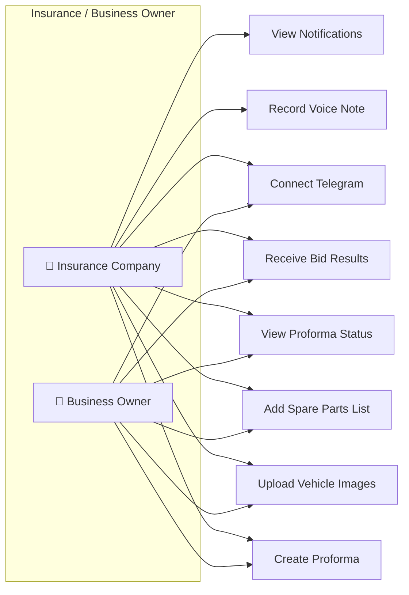

### Use Case Diagram — Admin

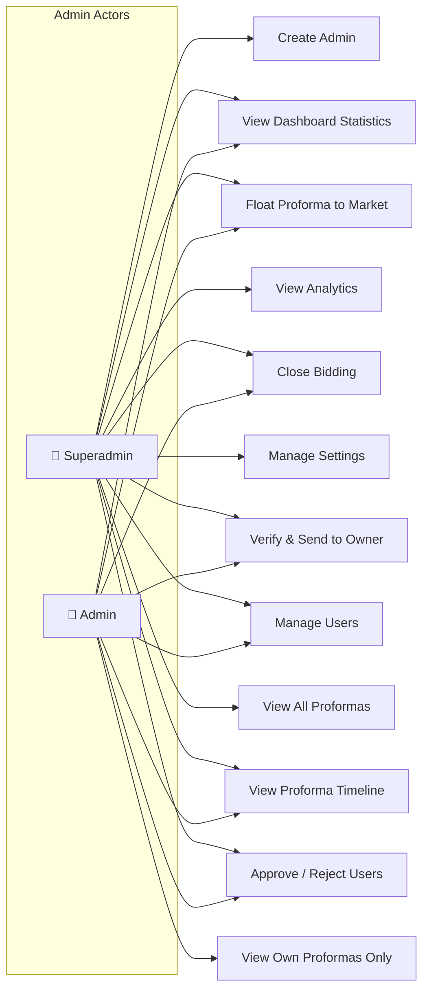

### Use Case Diagram — Garage / Spare Part Shop

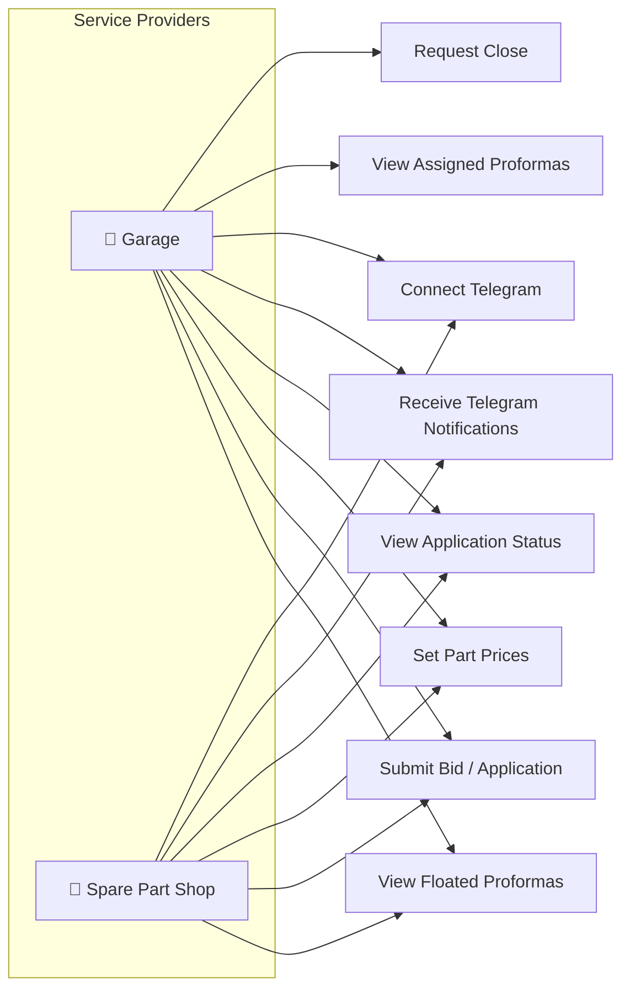

### Use Case Diagram — Operator / Employee / Marketer

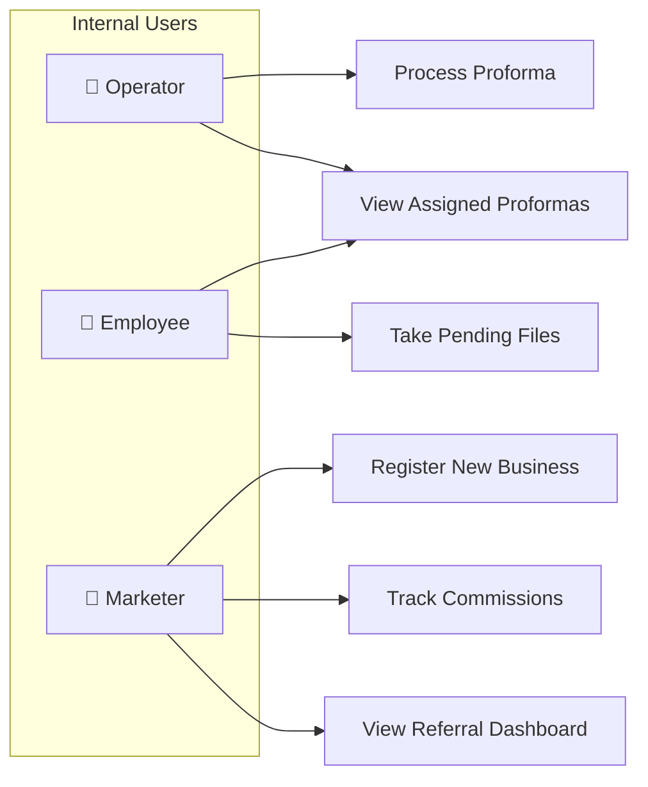

---

## Object Model

### Class Diagram

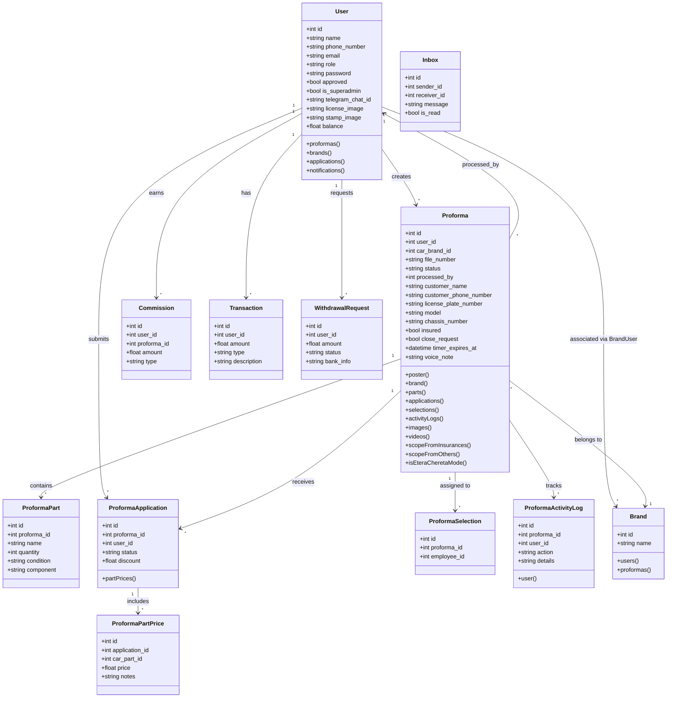

---

## Activity Diagrams

### Proforma Lifecycle

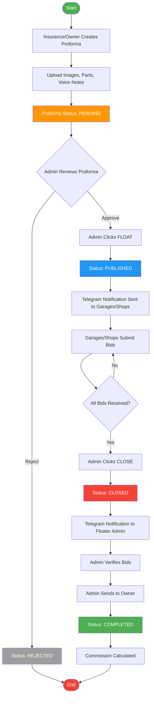

### User Registration & Approval

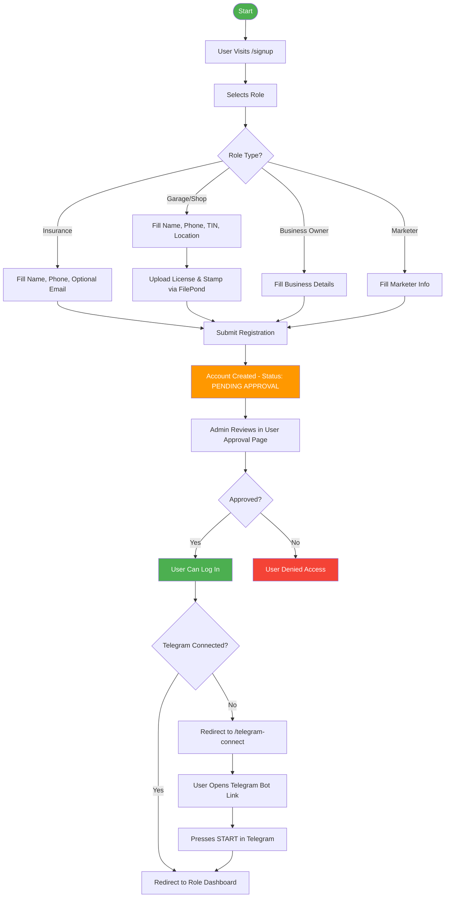

### Bidding Process (Garage / Spare Part Shop)

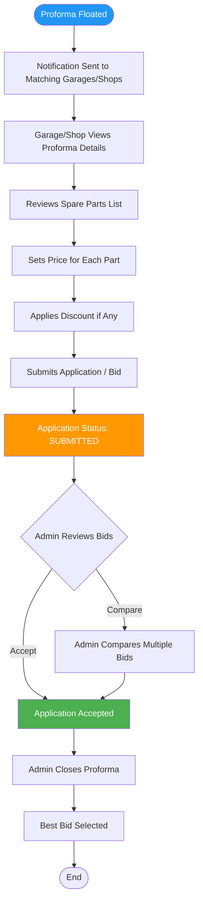

---

## Sequence Diagrams

### Proforma Creation to Completion

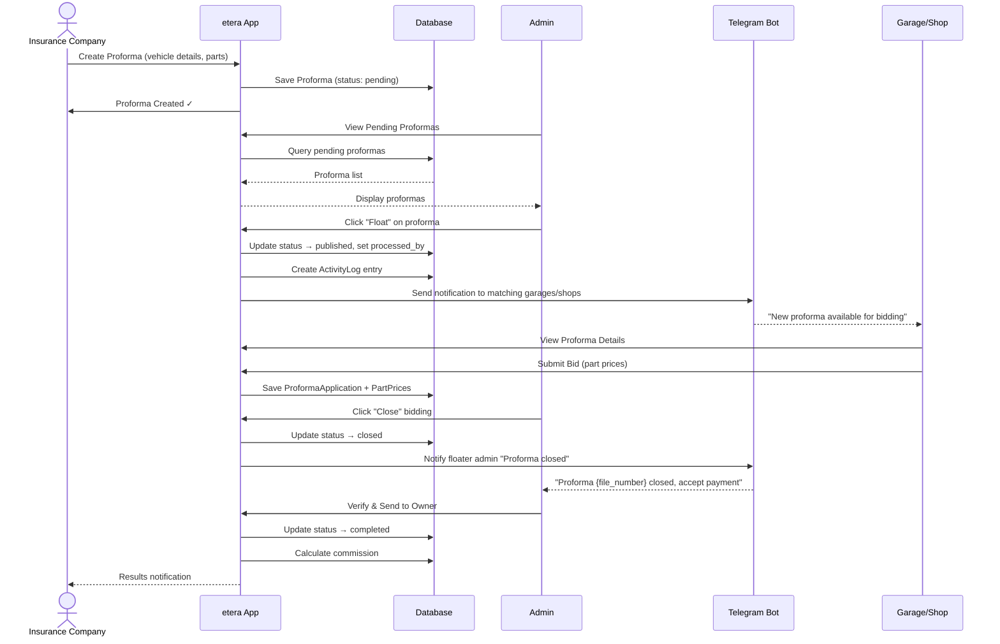

### Telegram Connection Flow

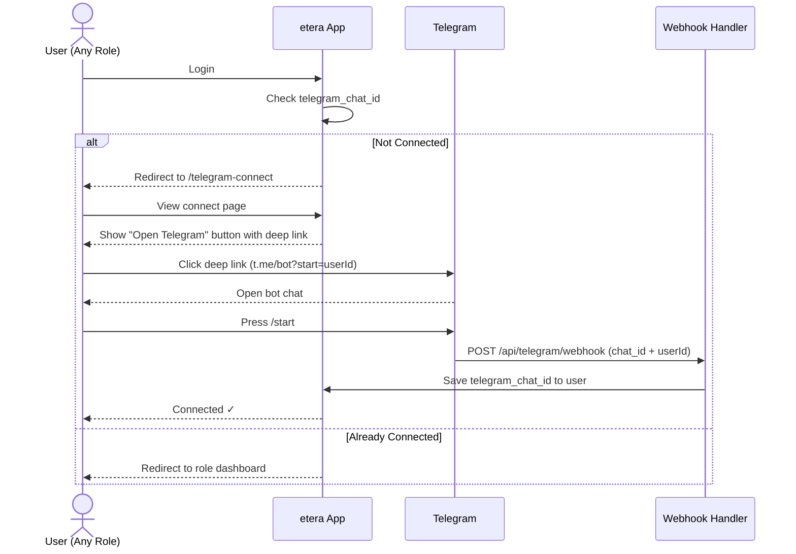

### Admin Float & Notification Flow

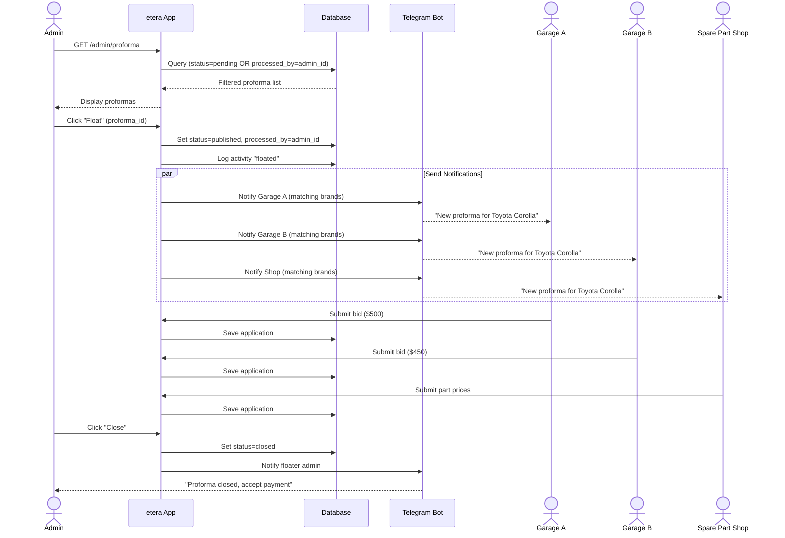

### User Registration & Approval Sequence

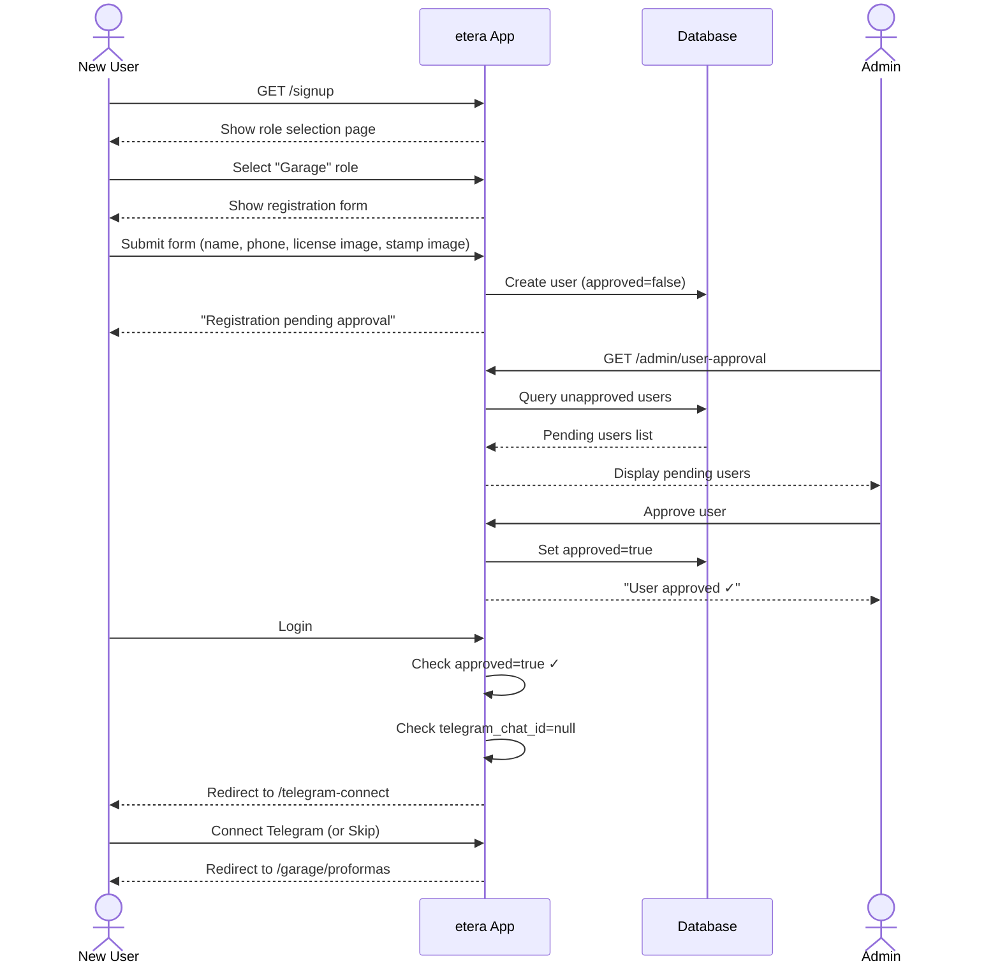


---

## Overview

**etera** is a full-featured proforma (quotation/estimate) management platform designed for the automotive insurance and repair industry. It connects **insurance companies**, **business owners**, **garages**, **spare part shops**, and **marketers** through a unified workflow — from proforma creation to completion, with built-in bidding, approval processes, and real-time notifications.

### Key Highlights

- 🏢 **Multi-role platform** — 10+ distinct user roles with tailored dashboards
- 📄 **Full proforma lifecycle** — Create → Float → Bid → Close → Verify → Complete
- 🔔 **Real-time notifications** — Telegram bot + in-app polling + Laravel Reverb WebSockets
- 🎯 **Intelligent routing** — Proformas filtered by brand, role, and assignment
- 💰 **Commission & wallet system** — Track earnings, pay commissions, manage withdrawals
- 📱 **Responsive design** — Mobile-friendly with modern UI

---

## Tech Stack

| Layer | Technology |
|-------|-----------|
| **Framework** | Laravel 11.x (PHP 8.2+) |
| **Frontend** | Blade Templates, Livewire 3, Bootstrap 5 |
| **Real-Time** | Laravel Reverb (WebSockets), Pusher Protocol |
| **Database** | MySQL / SQLite |
| **Media** | Spatie Media Library v11 |
| **File Upload** | FilePond, Livewire File Uploads |
| **Notifications** | Telegram Bot API, In-App Notifications |
| **Permissions** | Spatie Laravel Permission |
| **Build Tool** | Vite |
| **Testing** | PHPUnit 11 |

---

## System Requirements

- **PHP** >= 8.2
- **Composer** >= 2.x
- **Node.js** >= 18.x & npm
- **MySQL** >= 8.0 (or SQLite for local development)
- **PHP Extensions**: `mbstring`, `openssl`, `pdo`, `tokenizer`, `xml`, `ctype`, `json`, `bcmath`, `fileinfo`, `gd`

---

## Installation

### 1. Clone the Repository

```bash
git clone <repository-url> etera
cd etera
```

### 2. Install Dependencies

```bash
composer install
npm install
```

### 3. Environment Setup

```bash
cp .env.example .env
php artisan key:generate
```

### 4. Database Setup

```bash
php artisan migrate
php artisan db:seed   # (if seeders exist)
```

### 5. Build Frontend Assets

```bash
npm run dev       # Development
npm run build     # Production
```

### 6. Start the Server

```bash
php artisan serve
```

Visit `http://localhost:8000` in your browser.

---

## Environment Configuration

### Core Settings

```env
APP_NAME=etera
APP_ENV=local
APP_URL=http://localhost:8000
DB_CONNECTION=mysql
DB_DATABASE=etera
DB_USERNAME=root
DB_PASSWORD=
```

### Telegram Bot

```env
TELEGRAM_BOT_TOKEN=your-bot-token
TELEGRAM_BOT_USERNAME=your-bot-username
```

### Laravel Reverb (WebSockets)

```env
REVERB_APP_ID=your-app-id
REVERB_APP_KEY=your-app-key
REVERB_APP_SECRET=your-app-secret
REVERB_HOST=localhost
REVERB_PORT=8080
```

### Broadcasting

```env
BROADCAST_CONNECTION=reverb
```

---

## User Roles & Permissions

etera supports a rich hierarchy of roles, each with its own dashboard, views, and permissions:

| Role | Layout | Description |
|------|--------|-------------|
| **Superadmin** | `admin` | Full system access. Can create admins, view analytics, manage settings, see all proformas |
| **Admin** | `admin` | Manages proformas, floats files, creates other admins. Sees pending proformas + own processed proformas |
| **Manager** | `manager` | Oversees operations and employees |
| **Operator** | `operator` | Takes and processes proforma files assigned to them |
| **Employee** | `employee` | Selects and works on pending proformas |
| **Insurance** | `insurance` | Creates proformas for insured vehicles, views bidding results |
| **Business Owner** | `business-owner` | Creates proformas for non-insured vehicles ("others") |
| **Garage** | `sparepart` | Receives floated proformas, submits repair bids/applications |
| **Spare Part Shop** | `sparepart` | Receives floated proformas, submits spare part pricing |
| **Marketer** | `marketer` | Brings in new business, earns commissions |
| **Accountant** | `accountant` | Manages financial transactions and withdrawals |

### Role-Based Access Control

- **Proforma visibility**: Admins only see pending proformas + those they personally floated/processed
- **Superadmin override**: Dashboard stats show unfiltered counts; proforma lists still respect `processed_by` filter
- **Password policy**: Only users themselves can change their own passwords — admins cannot change any user's password
- **User approval**: New registrations require admin approval before access is granted
- **Email optional**: Email fields are optional across all registration forms

---

## Core Features

### Proforma Lifecycle

```
┌──────────┐     ┌──────────┐     ┌──────────┐     ┌──────────┐     ┌──────────┐     ┌──────────┐
│ Created  │ ──▷ │ Pending  │ ──▷ │ Floated  │ ──▷ │  Closed  │ ──▷ │ Verified │ ──▷ │Completed │
│(by user) │     │          │     │(published│     │(bids done│     │(sent to  │     │          │
│          │     │          │     │ by admin)│     │ by admin)│     │  owner)  │     │          │
└──────────┘     └──────────┘     └──────────┘     └──────────┘     └──────────┘     └──────────┘
```

1. **Created** — Insurance company or business owner creates a proforma with vehicle details, spare parts, and images
2. **Pending** — Visible to all admins/operators on the proforma list
3. **Floated (Published)** — An admin clicks "Float" to send the proforma out to garages and spare part shops for bidding
4. **Bidding** — Garages/shops submit applications with pricing for the spare parts
5. **Closed** — Admin closes bidding; Telegram notification sent to the admin who floated it
6. **Verified / Sent to Owner** — Admin verifies and sends results back to the insurance/business owner
7. **Completed** — Proforma workflow is finished

### Proforma Types

- **Insurance Proformas** — Created by insurance companies for insured vehicles
- **Others Proformas** — Created by business owners, garages, or individuals for non-insured vehicles
- **Etera-Chereta Mode** — Timed proformas with countdown timers and auto-selection

### Dashboard (Admin)

- **Collapsible statistics panel** with 12 stat cards (proforma counts, user counts by role)
- **Create Admin** section (superadmin only) with name, phone, optional email
- **Proforma table** with real-time polling for new entries (every 30 seconds)
- **Desktop notifications** for new incoming proformas

### Proforma Status Page

- Filter by status, admin, and search term
- **Timeline Modal** — View button shows the full lifecycle of a proforma (Created → Floated → Closed → ...) with dates, actors, and animated UI

### User Registration

- Multi-step wizard for complex registrations
- **FilePond** drag-and-drop file uploads for license and stamp images
- Role-based signup flows (`/signup` with role selection)
- Optional email across all forms
- Admin approval workflow

### Financial System

- **Commissions** — Track proforma-related earnings
- **Wallet** — User balance tracking
- **Transactions** — Full transaction history
- **Withdrawal Requests** — Users request payouts, admins approve
- **Costs Management** — Admin configures service costs

### Ratings & Reviews

- Users can rate garages and spare part shops
- Admin can view all ratings from the dashboard

---

## Architecture

### Directory Structure

```
app/
├── Events/                     # ProformaCreated, ProformaPublished, ProformaStatusChanged
├── Http/
│   ├── Controllers/            # 42 controllers for all roles & features
│   └── Middleware/             # Auth, role-based access middleware
├── Livewire/                   # 32 Livewire components
│   ├── ProformaList.php        # Insurance proforma list (with processed_by filter)
│   ├── OthersProformaList.php  # Others proforma list (with processed_by filter)
│   ├── CreateProforma.php      # Multi-step proforma creation
│   ├── SparePartsForm.php      # Spare parts management
│   └── ...
├── Models/                     # 32 Eloquent models
│   ├── Proforma.php            # Core model with scopes, relationships, lifecycle
│   ├── User.php                # Multi-role user model
│   ├── ProformaApplication.php # Garage/shop bid submissions
│   └── ...
├── Notifications/              # 10 notification classes
│   ├── ProformaFloatedNotification.php
│   ├── ProformaClosed.php
│   └── ...
└── Services/                   # 14 service classes
    ├── TelegramService.php     # Telegram Bot API integration
    ├── ProformaClosingService.php
    ├── WalletService.php
    └── ...

resources/views/
├── admin/                      # Admin dashboard, proforma management, user management
├── authentication/             # Login, signup, telegram-connect
├── livewire/                   # Livewire component views
├── layouts/                    # 10 role-specific layouts
│   ├── admin.blade.php
│   ├── business-owner.blade.php
│   ├── insurance.blade.php
│   ├── sparepart.blade.php
│   └── ...
└── partials/                   # Shared partials (green-theme, notification-polling, etc.)
```

### Key Models & Relationships

```
User
├── has many Proformas (as poster)
├── has many ProformaApplications
├── has many ProformaSelections (employees)
├── belongs to many Brands (through BrandUser)
├── has many Transactions
└── has many WithdrawalRequests

Proforma
├── belongs to User (poster)
├── belongs to Brand
├── has many ProformaParts
├── has many ProformaApplications
├── has many ProformaSelections
├── has many ActivityLogs
├── has many Images, Videos, Audio
└── has one ProformaInvoice
```

---

## Telegram Integration

etera integrates with the Telegram Bot API for instant push notifications.

### Setup

1. Create a Telegram Bot via [@BotFather](https://t.me/BotFather)
2. Set `TELEGRAM_BOT_TOKEN` and `TELEGRAM_BOT_USERNAME` in `.env`
3. Register the webhook:
   ```
   GET /admin/telegram/setup-webhook
   ```

### Connection Flow

1. At login, users without a connected Telegram account are redirected to `/telegram-connect`
2. They click "Open Telegram & Connect" (deep link: `t.me/{bot}?start={userId}`)
3. Press "Start" in Telegram
4. The webhook at `/api/telegram/webhook` processes the `/start` command and saves the `chat_id`
5. Users can skip and connect later

### Notification Types

| Event | Recipient | Message |
|-------|-----------|---------|
| Proforma floated | Garages/Shops | New proforma available for bidding |
| Proforma closed | Admin who floated | "The proforma {file_number} which you floated is closed, Please Accept payment and send it back to owner" |
| Sent to owner | Insurance/Business Owner | Proforma results ready |
| Application received | Admin | New bid submitted |

---

## Real-Time Features

### Laravel Reverb (WebSockets)

etera uses Laravel Reverb for real-time broadcasting:

- **ProformaStatusChanged** event — broadcasts status updates across dashboards
- **ProformaCreated** event — notifies admins of new incoming proformas
- **NotificationSent** event — real-time in-app notification updates

### Polling Fallback

The admin dashboard polls `/api/admin/proformas` every 30 seconds for new proformas, with desktop notification support.

### In-App Notifications

- Bell icon with unread count in the header
- Notification polling via `partials/notification-polling`
- Mark All as Read functionality

---

## File Uploads

### Supported Methods

| Method | Used In |
|--------|---------|
| **FilePond** | Garage/Spare Part Shop registration (license & stamp images) |
| **Livewire File Upload** | Proforma creation (images, videos, voice notes) |
| **Spatie Media Library** | Advanced media management with conversions |

### Supported File Types

- **Images** — JPEG, PNG, GIF, WebP
- **Videos** — MP4, AVI, MOV
- **Audio** — Voice notes (recorded in-browser)

---

## Database Schema

### Key Tables

| Table | Purpose |
|-------|---------|
| `users` | All user accounts with role, approval status, telegram_chat_id, superadmin flag |
| `proformas` | Core proforma data — vehicle info, status, poster, processed_by, timer settings |
| `proforma_part` | Spare parts listed in a proforma |
| `proforma_applications` | Bids submitted by garages/shops |
| `proforma_part_prices` | Individual part pricing from applications |
| `proforma_selections` | Employee/operator file assignments |
| `proforma_activity_logs` | Full lifecycle audit trail |
| `proforma_invoices` | Generated invoices |
| `brands` | Car brands catalog |
| `brand_users` | Brand-to-user associations (for filtering) |
| `car_parts` | Car parts catalog |
| `images` / `videos` / `audio` | Media attachments |
| `inboxes` | Internal messaging |
| `commissions` | Commission tracking |
| `costs` | Service cost configuration |
| `transactions` | Financial transactions |
| `withdrawal_requests` | Payout requests |
| `partners` | Partner organizations |
| `notifications` | Laravel notification storage |

### Running Migrations

```bash
php artisan migrate
```

> **Note**: See `MIGRATION_SAFETY_GUIDE.md` for guidance on running migrations in production.

---

## API Endpoints

### Authentication

| Method | Route | Description |
|--------|-------|-------------|
| `GET` | `/login` | Login page |
| `POST` | `/login` | Authenticate user |
| `DELETE` | `/logout` | Logout |
| `GET` | `/signup` | Role-based registration |
| `GET` | `/telegram-connect` | Telegram connection page |

### Admin Routes (prefix: `/admin`)

| Method | Route | Description |
|--------|-------|-------------|
| `GET` | `/admin` | Admin dashboard |
| `GET` | `/admin/proforma` | Insurance proforma list |
| `GET` | `/admin/others-proforma` | Others proforma list |
| `GET` | `/admin/proforma-statuses` | Proforma status overview |
| `GET` | `/admin/proforma/{id}/timeline` | Proforma lifecycle timeline (JSON) |
| `PATCH` | `/admin/proforma/{id}/close` | Close a proforma |
| `POST` | `/admin/create-admin` | Create a new admin user |
| `GET` | `/admin/insurances` | Manage insurance users |
| `GET` | `/admin/garages` | Manage garage users |
| `GET` | `/admin/spare-part-shops` | Manage spare part shop users |
| `GET` | `/admin/marketers` | Manage marketers |
| `GET` | `/admin/employees` | Manage operators |
| `GET` | `/admin/analytics` | View analytics (superadmin) |
| `GET` | `/admin/settings` | System settings (superadmin) |
| `GET` | `/admin/transactions` | View transactions (superadmin) |
| `GET` | `/admin/ratings` | View user ratings |
| `POST` | `/admin/proformas/{id}/approve` | Approve proforma |
| `POST` | `/admin/proformas/{proforma}/reject` | Reject proforma |
| `POST` | `/admin/proformas/{id}/send-to-garage` | Send to garage |
| `POST` | `/admin/proformas/{id}/send-to-insurance` | Send to insurance |

### Telegram

| Method | Route | Description |
|--------|-------|-------------|
| `POST` | `/api/telegram/webhook` | Telegram webhook receiver |
| `GET` | `/admin/telegram/setup-webhook` | Register webhook with Telegram |

---

## Testing

```bash
# Run all tests
php artisan test

# Run with coverage
php artisan test --coverage

# Run specific test suite
php artisan test --testsuite=Feature
```

See `TESTING_GUIDE.md` for detailed testing instructions.

---

## Deployment

### Production Checklist

1. **Environment**: Set `APP_ENV=production`, `APP_DEBUG=false`
2. **Optimize**:
   ```bash
   php artisan config:cache
   php artisan route:cache
   php artisan view:cache
   composer install --optimize-autoloader --no-dev
   npm run build
   ```
3. **Migrations**: `php artisan migrate --force`
4. **Telegram Webhook**: Visit `/admin/telegram/setup-webhook` once
5. **Queue Worker**: `php artisan queue:work` (for async notifications)
6. **Reverb**: `php artisan reverb:start` (for WebSockets)
7. **Scheduler**: Add to crontab:
   ```
   * * * * * cd /path-to-project && php artisan schedule:run >> /dev/null 2>&1
   ```

### Windows Server

Helper scripts are provided:
- `start-etera-chereta-webserver.bat` — Start the web server
- `start-etera-chereta-auto.bat` — Auto-start with services
- `check-proforma-closing.bat` — Proforma auto-close checker

See `ETERA-CHERETA-WEBSERVER-README.md` and `ETERA-CHERETA-AUTO-START-README.md` for detailed instructions.

---

## Troubleshooting

### Common Issues

| Issue | Solution |
|-------|----------|
| **CSRF 419 Error** | See `CSRF-419-ERROR-FIX-README.md` |
| **File uploads failing** | Check `php.ini` for `upload_max_filesize` and `post_max_size`; see `LIVEWIRE_FILE_UPLOAD_README.md` |
| **Telegram not connecting** | Verify `TELEGRAM_BOT_TOKEN` and run webhook setup |
| **Real-time not working** | Ensure Reverb is running (`php artisan reverb:start`) |
| **Proformas not filtering** | Check `processed_by` column is populated when admin clicks Float |
| **Route cache stale** | Run `php artisan route:clear && php artisan route:cache` |

### Useful Commands

```bash
php artisan route:list          # View all registered routes
php artisan migrate:status      # Check migration status
php artisan tinker               # Interactive REPL
php artisan queue:work           # Process queued jobs
php artisan reverb:start         # Start WebSocket server
```

---

## Additional Documentation

- [CSRF 419 Error Fix](CSRF-419-ERROR-FIX-README.md)
- [Etera-Chereta Implementation Summary](ETERA_CHERETA_IMPLEMENTATION_SUMMARY.md)
- [Etera-Chereta Auto-Start Guide](ETERA-CHERETA-AUTO-START-README.md)
- [Etera-Chereta Web Server Guide](ETERA-CHERETA-WEBSERVER-README.md)
- [File Upload & Cron Implementation](FILE_UPLOAD_AND_CRON_IMPLEMENTATION.md)
- [Livewire File Upload Guide](LIVEWIRE_FILE_UPLOAD_README.md)
- [Media Upload & Rendering Status](MEDIA_UPLOAD_AND_RENDERING_STATUS.md)
- [Migration Safety Guide](MIGRATION_SAFETY_GUIDE.md)
- [Proforma Closing System](PROFORMA_CLOSING_SYSTEM.md)
- [Testing Guide](TESTING_GUIDE.md)
- [Universal Signup & Admin Approval](UNIVERSAL-SIGNUP-ADMIN-APPROVAL-README.md)

---

## License

This project is proprietary software. All rights reserved.

---

<p align="center">
  <sub>Built with ❤️ using Laravel 11 • Livewire 3 • Laravel Reverb</sub>
</p>
